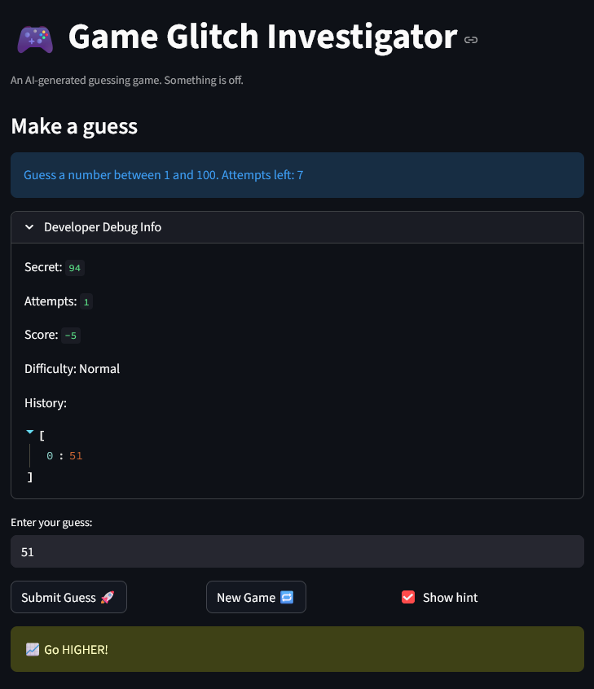
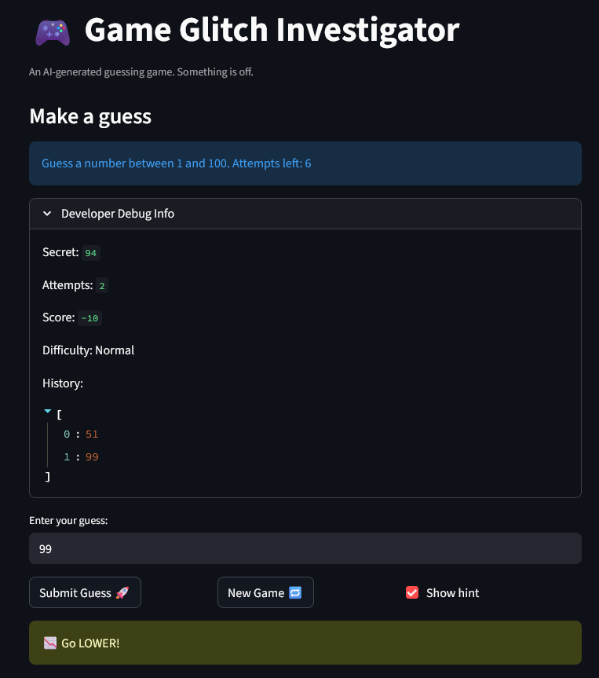
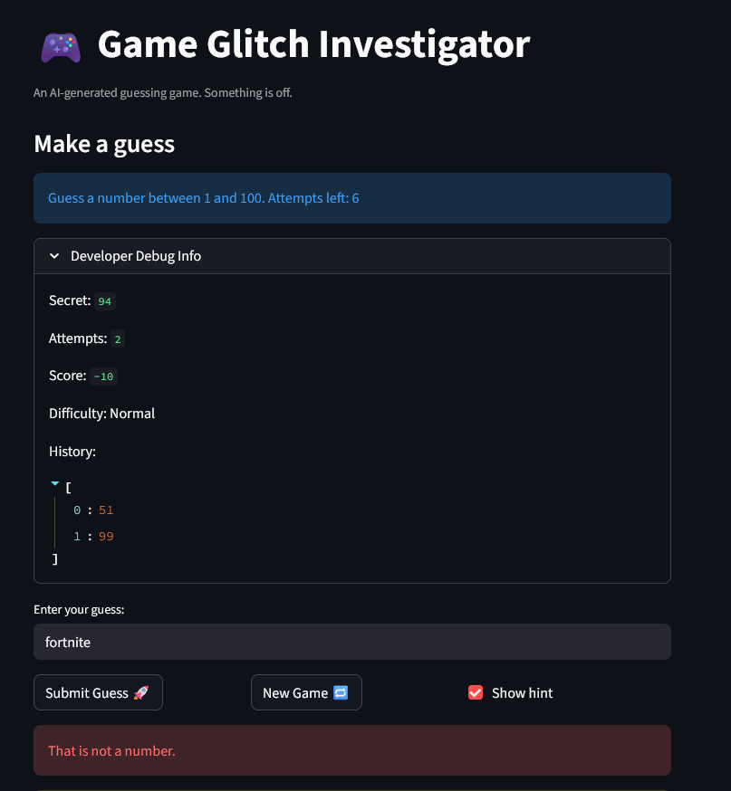
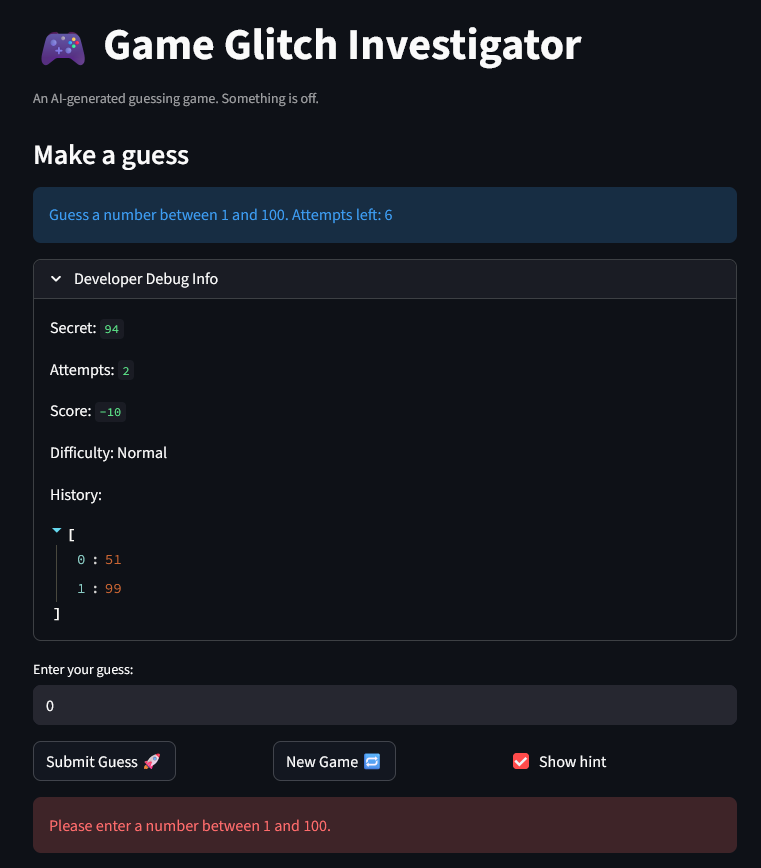
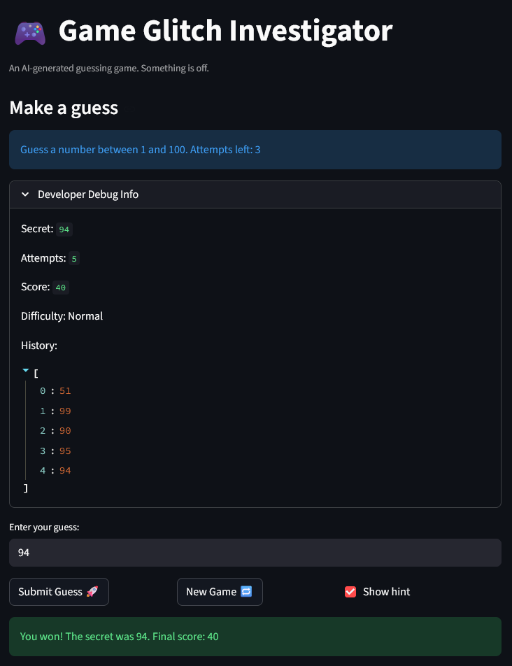
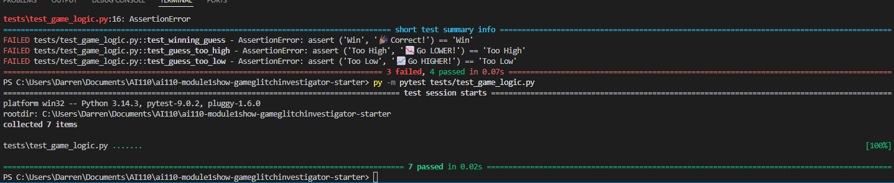

# 🎮 Game Glitch Investigator: The Impossible Guesser

## 🚨 The Situation

You asked an AI to build a simple "Number Guessing Game" using Streamlit.
It wrote the code, ran away, and now the game is unplayable. 

- You can't win.
- The hints lie to you.
- The secret number seems to have commitment issues.

## 🛠️ Setup

1. Install dependencies: `pip install -r requirements.txt`
2. Run the broken app: `python -m streamlit run app.py`

## 🕵️‍♂️ Your Mission

1. **Play the game.** Open the "Developer Debug Info" tab in the app to see the secret number. Try to win.
2. **Find the State Bug.** Why does the secret number change every time you click "Submit"? Ask ChatGPT: *"How do I keep a variable from resetting in Streamlit when I click a button?"*
3. **Fix the Logic.** The hints ("Higher/Lower") are wrong. Fix them.
4. **Refactor & Test.** - Move the logic into `logic_utils.py`.
   - Run `pytest` in your terminal.
   - Keep fixing until all tests pass!

## 📝 Document Your Experience

- [ ] Describe the game's purpose.
  - A number guessing game where the player tries to guess a secret number within a limited number of attempts. The difficulty setting controls the number range and attempt limit. Players earn points for guessing correctly, with fewer points the more attempts they use.

- [ ] Detail which bugs you found.
  - Switching difficulty did not reset the game. Invalid inputs counted as guesses and were recorded in the history. Guess history and hints did not update until the next guess was submitted. Check guess showed the wrong hints.

- [ ] Explain what fixes you applied.
  - I added a reset check so changing the difficulty starts a new game with a new secret number. I made invalid and out-of-range inputs get rejected without counting as attempts. I updated the game so history and hints refresh right away after each valid guess. I also restored the win screen with

## 📸 Demo

- [ ] [Insert a screenshot of your fixed, winning game here]

## 🚀 Stretch Features

- [ ] [If you choose to complete Challenge 4, insert a screenshot of your Enhanced Game UI here]
